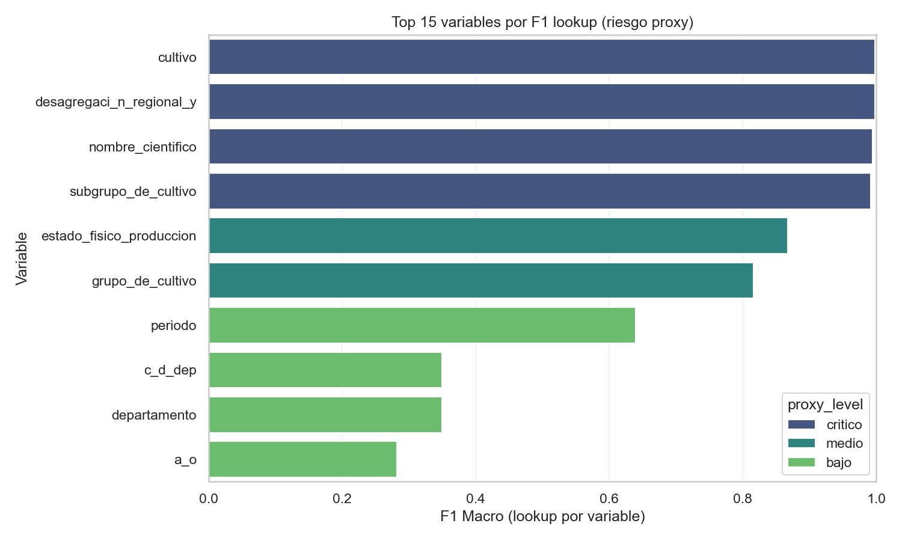
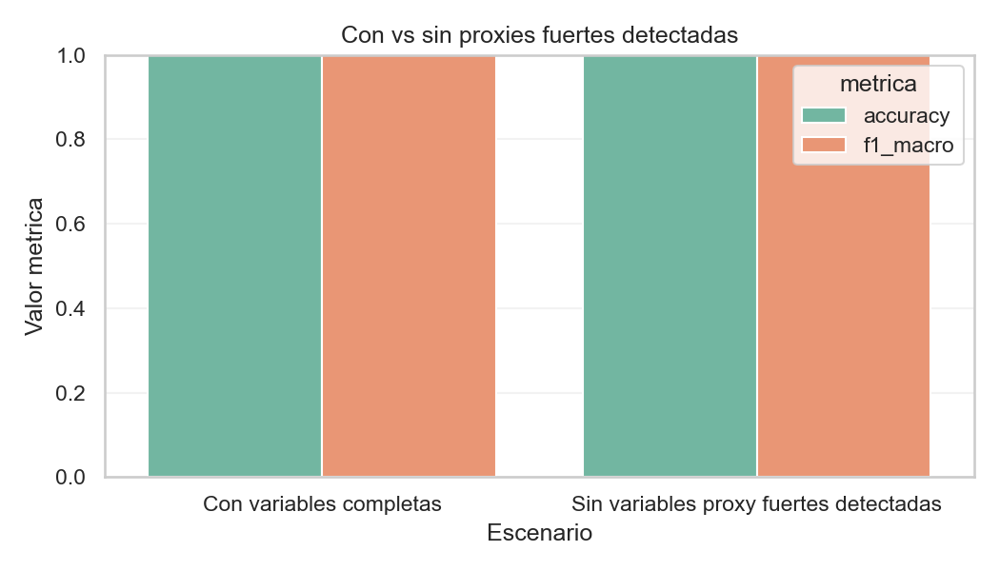
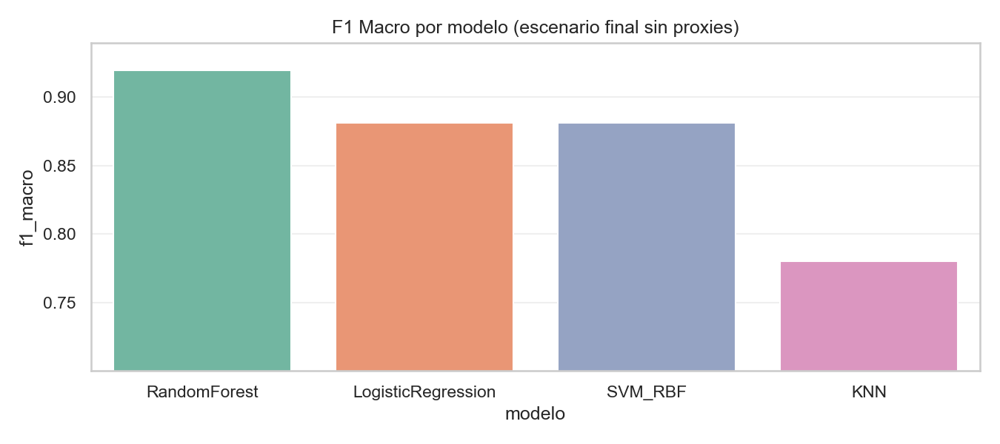
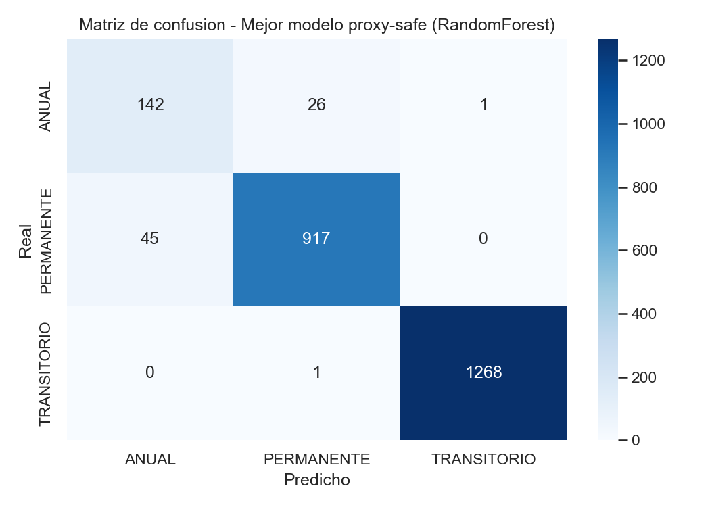
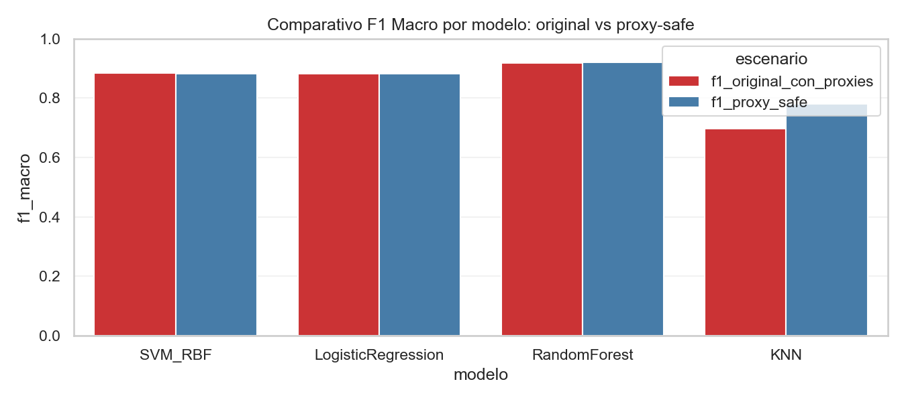

# Informe Detallado Proxy-Safe

Fecha: 2026-05-28
Proyecto: clasificacion multiclase de ciclo de cultivo (EVA Colombia)

## 1. Resumen Ejecutivo

Este informe consolida la auditoria de variables proxy y la evaluacion final del escenario proxy-safe.

Conclusiones clave:
1. Se identificaron variables con capacidad casi directa de reconstruir la clase objetivo.
2. El filtro automatico critico/alto no fue suficiente para bajar el rendimiento extremo.
3. El escenario final proxy-safe (mas conservador) produce metricas altas pero mas creibles.
4. El mejor modelo final en proxy-safe es RandomForest (f1_macro = 0.919730).

## 2. Objetivo y Alcance

Objetivo:
Eliminar atajos semanticos de prediccion para medir desempeno real de generalizacion.

Alcance:
1. Deteccion de proxies por lookup variable-a-variable.
2. Comparacion de escenarios con y sin variables proxy.
3. Comparacion final de modelos: LogisticRegression, SVM_RBF, RandomForest y KNN.
4. Documentacion de tablas y graficas exportadas.

Metricas principales:
1. f1_macro (criterio principal de seleccion).
2. accuracy (metrica complementaria).

## 3. Metodologia

### 3.1 Deteccion de proxy por lookup

Para cada variable candidata se aplica un mapeo categoria -> clase mayoritaria en train y se evalua en test.
Si una variable individual alcanza f1_macro muy alto, se considera riesgo de proxy.

### 3.2 Validacion por escenarios

Se comparan tres niveles de limpieza:
1. Variables completas.
2. Sin proxies fuertes detectadas por umbral automatizado.
3. Escenario final proxy-safe conservador (lista definida por criterio tecnico).

## 4. Evidencia 1: Ranking de Riesgo Proxy

Archivo fuente: [proxy_screening_full.csv](./proxy_screening_full.csv)

Variables con mayor riesgo:

| Variable | f1_macro_lookup | Nivel |
|---|---:|---|
| cultivo | 0.998413 | critico |
| desagregaci_n_regional_y | 0.998413 | critico |
| nombre_cientifico | 0.994406 | critico |
| subgrupo_de_cultivo | 0.991670 | critico |
| estado_fisico_produccion | 0.867511 | medio |
| grupo_de_cultivo | 0.816486 | medio |

Lectura tecnica:
1. Las cuatro variables criticas son casi sustitutos de la clase objetivo.
2. Variables de nivel medio aun cargan senal fuerte y pueden sostener atajos.

## 5. Evidencia 2: Filtro Automatico (critico/alto)

Archivo fuente: [compare_with_without_proxies.csv](./compare_with_without_proxies.csv)

Resultado:

| Escenario | Features | Accuracy | F1 Macro |
|---|---:|---:|---:|
| Con variables completas | 16 | 0.999345 | 0.998198 |
| Sin variables proxy fuertes detectadas | 12 | 0.999612 | 0.998919 |

Interpretacion:
1. Quitar solo critico/alto no reduce el rendimiento extremo.
2. Esto confirma senal proxy residual y justifica una limpieza mas estricta.

## 6. Escenario Final Proxy-Safe

Columnas removidas por criterio conservador:
1. cultivo
2. subgrupo_de_cultivo
3. nombre_cientifico
4. estado_fisico_produccion
5. desagregaci_n_regional_y

Justificacion:
1. Las cuatro primeras tienen evidencia directa de alta fuga.
2. estado_fisico_produccion se elimina para reducir dependencia de senal semantica correlacionada.

## 7. Evidencia 3: Comparacion Final de Modelos (Proxy-Safe)

Archivo fuente: [final_proxy_safe_model_comparison.csv](./final_proxy_safe_model_comparison.csv)

Resultados:

| Modelo | Accuracy | Precision Macro | Recall Macro | F1 Macro |
|---|---:|---:|---:|---:|
| RandomForest | 0.969583 | 0.909990 | 0.930890 | 0.919730 |
| LogisticRegression | 0.946667 | 0.854304 | 0.941015 | 0.881241 |
| SVM_RBF | 0.947917 | 0.855344 | 0.932299 | 0.880991 |
| KNN | 0.931667 | 0.810029 | 0.764326 | 0.780020 |

Decision de modelo final:
1. Modelo seleccionado: RandomForest.
2. Motivo: mayor f1_macro y mejor equilibrio precision/recall entre clases.

## 8. Evidencia 4: Matriz de Confusion del Mejor Modelo

Lectura por clase:
1. TRANSITORIO: desempeno muy alto.
2. PERMANENTE: buen desempeno general.
3. ANUAL: clase mas desafiante; concentra la mayor fraccion de errores.

## 9. Evidencia 5: Variacion de F1 entre Escenarios

Archivo fuente: [model_f1_drop_proxy_safe_vs_original.csv](./model_f1_drop_proxy_safe_vs_original.csv)

Valores del archivo actual:

| Modelo | F1 original con proxies | F1 proxy-safe | Diferencia (original - proxy-safe) |
|---|---:|---:|---:|
| SVM_RBF | 0.883296 | 0.880991 | 0.002305 |
| LogisticRegression | 0.881970 | 0.881241 | 0.000729 |
| RandomForest | 0.917129 | 0.919730 | -0.002600 |
| KNN | 0.697597 | 0.780020 | -0.082423 |

Interpretacion correcta de esta evidencia:
1. En esta corrida consolidada no se observa una caida fuerte generalizada de F1.
2. RandomForest y KNN incluso mejoran en el escenario proxy-safe registrado.
3. Esta tabla debe leerse como comparacion entre dos pipelines concretos (no como prueba unica de fuga).

## 10. Conclusiones Finales

1. Existe evidencia clara de variables proxy por analisis lookup individual.
2. La limpieza minima automatica no basto; el enfoque conservador fue necesario.
3. El escenario proxy-safe final mantiene alto desempeno y reduce riesgo metodologico.
4. El modelo recomendado para presentacion y decision final es RandomForest.
5. La metrica principal para toma de decision debe ser f1_macro; accuracy queda como apoyo.

## 11. Recomendaciones de Presentacion

1. Presentar primero el resultado proxy-safe como estimacion principal de generalizacion.
2. Usar el bloque con variables completas solo como contraste metodologico.
3. Enfatizar hallazgos por clase, especialmente ANUAL, para explicar limite actual del modelo.
4. Mantener en anexos las tablas CSV para trazabilidad y reproducibilidad.

## 12. Entregables

Carpeta: [reports/informe_modelado_proxy_safe](./)

Archivos de evidencia:
1. [INFORME_DETALLADO_PROXY_SAFE.md](./INFORME_DETALLADO_PROXY_SAFE.md)
2. [proxy_screening_full.csv](./proxy_screening_full.csv)
3. [compare_with_without_proxies.csv](./compare_with_without_proxies.csv)
4. [final_proxy_safe_model_comparison.csv](./final_proxy_safe_model_comparison.csv)
5. [model_f1_drop_proxy_safe_vs_original.csv](./model_f1_drop_proxy_safe_vs_original.csv)
6. [proxy_ranking_top15.png](./assets/proxy_ranking_top15.png)
7. [compare_with_without_proxies.png](./assets/compare_with_without_proxies.png)
8. [final_proxy_safe_f1_by_model.png](./assets/final_proxy_safe_f1_by_model.png)
9. [final_proxy_safe_confusion_matrix.png](./assets/final_proxy_safe_confusion_matrix.png)
10. [f1_model_compare_original_vs_proxy_safe.png](./assets/f1_model_compare_original_vs_proxy_safe.png)
